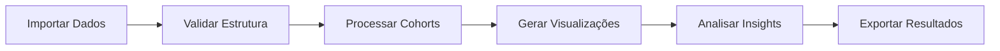

# 📊 Data Analysis Excel - Cohort Analysis

<div align="center">


**Análise de Cohort desenvolvida 100% em Excel**

[Sobre](#-sobre) • [Funcionalidades](#-funcionalidades) • [Estrutura](#-estrutura-do-projeto) • [Como Usar](#-como-usar) • [Metodologia](#-metodologia) • [Contribuindo](#-contribuindo)

</div>

---

## 📋 Sobre

Este projeto apresenta uma **análise completa de Cohort** desenvolvida inteiramente no Microsoft Excel, demonstrando técnicas avançadas de análise de dados sem a necessidade de ferramentas de programação.

### 🎯 Objetivos

- Realizar análise de cohort para entender o comportamento de usuários ao longo do tempo
- Demonstrar o poder do Excel para análises de dados complexas
- Criar visualizações claras e acionáveis
- Fornecer insights sobre retenção e engajamento de clientes

### 🔍 O que é Cohort Analysis?

Cohort Analysis é uma técnica analítica que divide usuários em grupos relacionados (cohorts) e acompanha seu comportamento ao longo do tempo. É especialmente útil para:

- **Análise de Retenção**: Quantos clientes continuam usando o produto?
- **Identificação de Padrões**: Quando os usuários tendem a abandonar?
- **Validação de Mudanças**: Novos recursos melhoraram a retenção?
- **Segmentação**: Diferentes grupos se comportam de maneira diferente?

---

## ✨ Funcionalidades

- ✅ **Análise de Retenção por Cohort**: Acompanhamento de usuários ao longo de períodos específicos
- ✅ **Visualizações Dinâmicas**: Gráficos e tabelas dinâmicas para fácil interpretação
- ✅ **Cálculos Automatizados**: Fórmulas avançadas do Excel para análise em tempo real
- ✅ **Formatação Condicional**: Identificação visual de tendências e padrões
- ✅ **Métricas de Performance**: KPIs essenciais para tomada de decisão
- ✅ **Dashboard Interativo**: Visão consolidada dos principais insights

---

## 🌐 Dashboard Web Interativo

**[🚀 Acesse o Dashboard](https://euuuller.github.io/Data-Analysis-Excel/dashboard/)**

Desenvolvemos um dashboard web completo para visualização interativa dos dados de cohort:

### Recursos do Dashboard
- 📊 **Upload de Dados**: Carregue seus próprios arquivos CSV ou Excel
- 📈 **Visualizações Interativas**: Gráficos dinâmicos com Chart.js
- 🎨 **Heatmap de Retenção**: Matriz colorida para identificar padrões
- 📱 **Responsivo**: Funciona perfeitamente em desktop, tablet e mobile
- 💾 **Exportação**: Baixe os dados processados em CSV

[Ver documentação completa do dashboard →](dashboard/README.md)

---

## 📁 Estrutura do Projeto

```
Data-Analysis-Excel/
│
├── 📄 README.md                    # Documentação principal
├── 📄 LICENSE                      # Licença do projeto
├── 📄 .gitignore                   # Arquivos ignorados pelo Git
│
├── 📂 docs/                        # Documentação adicional
│   ├── metodologia.md              # Detalhes da metodologia aplicada
│   ├── formulas.md                 # Explicação das fórmulas utilizadas
│   └── insights.md                 # Principais insights e conclusões
│
├── 📂 data/                        # Dados de exemplo (não sensíveis)
│   ├── sample_data.md              # Estrutura dos dados esperados
│   └── data_dictionary.md          # Dicionário de dados
│
├── 📂 images/                      # Screenshots e visualizações
│   ├── dashboard.png               # Captura do dashboard
│   ├── cohort_table.png            # Tabela de cohort
│   └── charts/                     # Gráficos exportados
│
├── 📂 templates/                   # Templates reutilizáveis
│   └── cohort_template.md          # Template para novas análises
│
└── 📂 output/                      # Resultados exportados
    └── .gitkeep                    # Mantém a pasta no Git
```

> **⚠️ Nota**: Os arquivos Excel (`.xlsx`, `.xlsm`, `.xls`) não são versionados por questões de boas práticas e segurança de dados.

---

## 🚀 Como Usar

### Pré-requisitos

- Microsoft Excel 2016 ou superior
- Conhecimento básico de Excel e análise de dados

### Instalação

1. **Clone o repositório**
   ```bash
   git clone https://github.com/Euuuller/Data-Analysis-Excel.git
   cd Data-Analysis-Excel
   ```

2. **Prepare seus dados**
   - Consulte `data/sample_data.md` para entender a estrutura necessária
   - Organize seus dados seguindo o formato especificado

3. **Configure a análise**
   - Abra o arquivo Excel (não versionado)
   - Importe seus dados na aba "Dados Brutos"
   - As análises serão atualizadas automaticamente

### Fluxo de Trabalho



---

## 📊 Metodologia

### 1. Definição de Cohorts

Os cohorts são definidos com base na **data de primeira interação** do usuário. Cada cohort representa um grupo de usuários que iniciaram no mesmo período (semana/mês).

### 2. Cálculo de Retenção

```
Taxa de Retenção = (Usuários Ativos no Período N / Total de Usuários no Cohort) × 100
```

### 3. Períodos Analisados

- **Período 0**: Período de aquisição
- **Período 1-12**: Meses subsequentes de acompanhamento

### 4. Métricas Principais

| Métrica | Descrição | Fórmula |
|---------|-----------|---------|
| **Retenção Absoluta** | Usuários que retornaram | `CONT.SE()` |
| **Retenção Relativa** | Percentual de retenção | `(Ativos/Total)*100` |
| **Churn Rate** | Taxa de abandono | `100 - Retenção` |
| **LTV Estimado** | Valor do tempo de vida | `Retenção × Ticket Médio` |

---

## 📈 Principais Insights

> Esta seção será atualizada conforme a análise progride. Consulte `docs/insights.md` para detalhes completos.

### Exemplo de Insights

- 📌 **Retenção Mês 1**: XX% dos usuários retornam após o primeiro mês
- 📌 **Ponto de Inflexão**: Maior queda de retenção ocorre no mês X
- 📌 **Cohorts de Melhor Performance**: Identificados em [período]
- 📌 **Tendências Sazonais**: Padrões observados em [meses específicos]

---

## 🛠️ Tecnologias e Técnicas

### Recursos do Excel Utilizados

- **Tabelas Dinâmicas**: Agregação e sumarização de dados
- **Fórmulas Avançadas**: `ÍNDICE`, `CORRESP`, `SOMASES`, `SE.ERRO`
- **Formatação Condicional**: Heatmaps para visualização de retenção
- **Gráficos Dinâmicos**: Visualizações interativas
- **Validação de Dados**: Garantia de qualidade dos inputs
- **Segmentação de Dados**: Filtros dinâmicos para análise

### Boas Práticas Aplicadas

✅ Separação clara entre dados brutos e análises  
✅ Nomenclatura consistente de células e intervalos  
✅ Documentação inline com comentários  
✅ Validação de dados para prevenir erros  
✅ Backup automático com versionamento  
✅ Proteção de fórmulas críticas  

---

## 📚 Documentação Adicional

- **[Metodologia Detalhada](docs/metodologia.md)**: Explicação completa do processo analítico
- **[Guia de Fórmulas](docs/formulas.md)**: Detalhamento de todas as fórmulas utilizadas
- **[Dicionário de Dados](data/data_dictionary.md)**: Descrição de cada campo
- **[Template Reutilizável](templates/cohort_template.md)**: Como adaptar para outros projetos

---

## 🤝 Contribuindo

Contribuições são bem-vindas! Este projeto é uma demonstração de análise de dados com Excel, e sugestões de melhorias são sempre apreciadas.

### Como Contribuir

1. Faça um Fork do projeto
2. Crie uma branch para sua feature (`git checkout -b feature/MinhaFeature`)
3. Commit suas mudanças (`git commit -m 'Adiciona nova funcionalidade'`)
4. Push para a branch (`git push origin feature/MinhaFeature`)
5. Abra um Pull Request

### Áreas de Contribuição

- 📊 Novas visualizações e dashboards
- 🔧 Otimização de fórmulas
- 📖 Melhorias na documentação
- 🎨 Templates adicionais
- 🐛 Correção de bugs

---

## 📝 Licença

Este projeto está sob a licença MIT. Veja o arquivo [LICENSE](LICENSE) para mais detalhes.

---

## 👤 Autor

**Euller dos Santos**

- GitHub: [@Euuuller](https://github.com/Euuuller)
- Portfolio: [euuuller.github.io/Portfolio](https://euuuller.github.io/Portfolio/)
- LinkedIn: [Conecte-se comigo](https://www.linkedin.com/in/euller-santos/)

---

## 🙏 Agradecimentos

- Comunidade de Data Analysis por inspiração e boas práticas
- Microsoft Excel pela ferramenta poderosa e acessível
- Todos que contribuírem com feedback e sugestões

---

<div align="center">

**⭐ Se este projeto foi útil, considere dar uma estrela!**

**Desenvolvido com 📊 e ☕ por [Euller dos Santos](https://github.com/Euuuller)**

</div>
