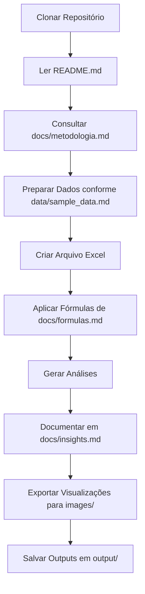

# 📁 Estrutura do Projeto - Data Analysis Excel

## 🎯 Visão Geral da Estrutura

```
Data-Analysis-Excel/
│
├── 📄 .gitignore                           # Configuração de arquivos ignorados
├── 📄 README.md                            # Documentação principal do projeto
├── 📄 LICENSE                              # Licença MIT
├── 📊 Data-Analysis-Excel.xlsx             # Arquivo Excel (não versionado)
│
├── 📂 docs/                                # Documentação técnica
│   ├── metodologia.md                      # Metodologia da análise de cohort
│   ├── formulas.md                         # Guia completo de fórmulas Excel
│   └── insights.md                         # Template para documentar insights
│
├── 📂 data/                                # Especificações de dados
│   ├── sample_data.md                      # Estrutura de dados esperada
│   └── data_dictionary.md                  # Dicionário de dados completo
│
├── 📂 images/                              # Imagens e visualizações
│   └── charts/                             # Gráficos exportados
│
├── 📂 templates/                           # Templates reutilizáveis
│   └── cohort_template.md                  # Template para novas análises
│
└── 📂 output/                              # Resultados exportados
    └── .gitkeep                            # Mantém pasta no Git
```

---

## 📋 Descrição dos Arquivos

### Arquivos Raiz

#### `.gitignore`
Configuração do Git para ignorar:
- ✅ Arquivos Excel (*.xlsx, *.xlsm, *.xls)
- ✅ Arquivos CSV
- ✅ Arquivos temporários
- ✅ Configurações de IDE
- ✅ Arquivos de sistema operacional

#### `README.md`
Documentação principal contendo:
- Descrição do projeto
- Objetivos da análise
- Estrutura do projeto
- Como usar
- Metodologia resumida
- Tecnologias utilizadas

#### `LICENSE`
Licença MIT permitindo uso livre do projeto.

#### `Data-Analysis-Excel.xlsx` ⚠️ NÃO VERSIONADO
Arquivo Excel principal com a análise (ignorado pelo Git).

---

### 📂 Pasta `docs/`

Documentação técnica detalhada:

#### `metodologia.md`
- Fundamentos teóricos de Cohort Analysis
- Metodologia aplicada passo a passo
- Cálculo de métricas
- Análise e interpretação
- Aplicações práticas
- Referências

#### `formulas.md`
- Todas as fórmulas Excel utilizadas
- Explicações detalhadas
- Exemplos práticos
- Fórmulas avançadas
- Troubleshooting
- Referência rápida

#### `insights.md`
- Template para documentar descobertas
- Estrutura para insights
- Recomendações acionáveis
- Visualizações principais
- Próximos passos

---

### 📂 Pasta `data/`

Especificações sobre dados:

#### `sample_data.md`
- Formato dos dados esperados
- Exemplos de datasets
- Regras de validação
- Preparação de dados
- Checklist de preparação

#### `data_dictionary.md`
- Definição de todos os campos
- Tipos de dados
- Validações
- Exemplos
- Regras de negócio

---

### 📂 Pasta `images/`

Armazenamento de imagens:

#### `charts/`
Subpasta para gráficos exportados:
- Curvas de retenção
- Heatmaps
- Comparações
- Dashboards

**Formatos aceitos**: PNG, JPG, SVG

---

### 📂 Pasta `templates/`

Templates reutilizáveis:

#### `cohort_template.md`
- Template completo para novas análises
- Configuração passo a passo
- Checklist de implementação
- Adaptações comuns
- Troubleshooting

---

### 📂 Pasta `output/`

Resultados exportados (não versionados):

- Gráficos exportados
- Relatórios em PDF
- Dados agregados em CSV
- Outros outputs temporários

**Nota**: Conteúdo ignorado pelo Git, mas estrutura mantida.

---

## 🔄 Fluxo de Trabalho



---

## 📊 Arquivos por Categoria

### Documentação (5 arquivos)
- `README.md`
- `docs/metodologia.md`
- `docs/formulas.md`
- `docs/insights.md`
- `templates/cohort_template.md`

### Especificações de Dados (2 arquivos)
- `data/sample_data.md`
- `data/data_dictionary.md`

### Configuração (2 arquivos)
- `.gitignore`
- `LICENSE`

### Estrutura (3 pastas vazias)
- `images/charts/`
- `templates/`
- `output/`

---

## 🎯 Próximos Passos

### Para Começar a Usar

1. ✅ Clone o repositório
2. ✅ Leia o `README.md`
3. ✅ Estude `docs/metodologia.md`
4. ✅ Prepare seus dados conforme `data/sample_data.md`
5. ✅ Crie seu arquivo Excel
6. ✅ Aplique as fórmulas de `docs/formulas.md`
7. ✅ Documente insights em `docs/insights.md`

### Para Contribuir

1. Fork o projeto
2. Crie uma branch (`git checkout -b feature/MinhaFeature`)
3. Commit suas mudanças
4. Push para a branch
5. Abra um Pull Request

---

## 🔒 Segurança

### Arquivos Versionados ✅
- Documentação (.md)
- Configurações (.gitignore, LICENSE)
- Templates
- Estrutura de pastas

### Arquivos NÃO Versionados ⚠️
- Arquivos Excel (.xlsx, .xlsm, .xls)
- Arquivos CSV
- Dados sensíveis
- Outputs temporários
- Configurações locais

---

## 📈 Estatísticas do Projeto

| Métrica | Valor |
|---------|-------|
| **Total de Arquivos** | 10+ arquivos |
| **Linhas de Documentação** | 2000+ linhas |
| **Pastas Organizadas** | 5 pastas |
| **Templates Incluídos** | 1 template completo |
| **Guias Técnicos** | 3 guias detalhados |

---

## 🆘 Ajuda Rápida

### Onde encontrar...

| Preciso de... | Veja o arquivo... |
|---------------|-------------------|
| Visão geral do projeto | `README.md` |
| Como fazer a análise | `docs/metodologia.md` |
| Fórmulas Excel | `docs/formulas.md` |
| Estrutura de dados | `data/sample_data.md` |
| Definição de campos | `data/data_dictionary.md` |
| Template para nova análise | `templates/cohort_template.md` |
| Documentar resultados | `docs/insights.md` |

---

**Última atualização**: Janeiro 2026  
**Versão**: 1.0  
**Mantido por**: [@Euuuller](https://github.com/Euuuller)
