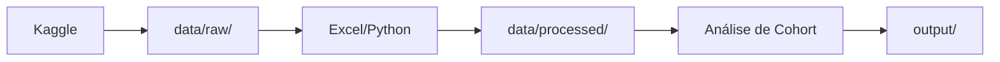

# 📊 Estrutura de Dados - Organização

## 📁 Organização das Pastas de Dados

```
data/
├── raw/              # Dados brutos do Kaggle (CSV originais)
├── processed/        # Dados processados/limpos
├── sample/           # Amostras pequenas para testes
├── sample_data.md    # Documentação da estrutura
└── data_dictionary.md # Dicionário de dados
```

---

## 📂 Pasta `raw/`

**Propósito**: Armazenar os dados originais do Kaggle sem modificações.

**Conteúdo**:
- ✅ Arquivos CSV originais do Kaggle
- ✅ Dados públicos
- ✅ Versionados no Git

**Regras**:
- ❌ NUNCA modificar esses arquivos
- ✅ Manter exatamente como baixados do Kaggle
- ✅ Adicionar README.md com link do dataset

**Exemplo**:
```
data/raw/
├── README.md              # Link do Kaggle + descrição
├── transactions.csv       # Dados de transações
├── customers.csv          # Dados de clientes
└── events.csv            # Dados de eventos
```

---

## 📂 Pasta `processed/`

**Propósito**: Armazenar dados após limpeza e processamento.

**Conteúdo**:
- Dados limpos
- Dados agregados
- Dados transformados para análise

**Regras**:
- ✅ Pode ser versionado se não for muito grande
- ⚠️ Adicionar ao `.gitignore` se arquivos > 100MB

**Exemplo**:
```
data/processed/
├── cohort_data.csv        # Dados processados para cohort
├── user_summary.csv       # Resumo por usuário
└── monthly_metrics.csv    # Métricas mensais
```

---

## 📂 Pasta `sample/`

**Propósito**: Amostras pequenas para testes e exemplos.

**Conteúdo**:
- Subconjuntos dos dados
- Exemplos para documentação
- Dados para testes rápidos

**Exemplo**:
```
data/sample/
├── sample_100_rows.csv    # 100 primeiras linhas
└── sample_cohort.csv      # Exemplo de cohort
```

---

## 📝 Arquivo `data/raw/README.md`

Sempre inclua um README na pasta `raw/` com:

```markdown
# Dados Brutos - Kaggle

## 📊 Dataset Original

**Nome**: [Nome do Dataset]  
**Fonte**: [Link do Kaggle]  
**Autor**: [Autor no Kaggle]  
**Licença**: [Tipo de licença]  
**Data de Download**: [Data]

## 📁 Arquivos Incluídos

- `transactions.csv` - Descrição
- `customers.csv` - Descrição
- `events.csv` - Descrição

## 🔗 Links

- [Dataset no Kaggle](URL)
- [Documentação Original](URL se houver)

## ⚠️ Importante

Estes arquivos são os dados ORIGINAIS do Kaggle.
NÃO modifique estes arquivos. Use a pasta `processed/` para dados transformados.
```

---

## 🎯 Fluxo de Trabalho Recomendado



1. **Download**: Baixar dados do Kaggle → `data/raw/`
2. **Processamento**: Limpar/transformar → `data/processed/`
3. **Análise**: Usar no Excel para cohort analysis
4. **Resultados**: Exportar para `output/`

---

## 📏 Limites de Tamanho

### GitHub tem limite de 100MB por arquivo

**Se seus CSVs forem grandes (>50MB)**:

1. **Opção 1**: Usar Git LFS (Large File Storage)
   ```bash
   git lfs install
   git lfs track "*.csv"
   ```

2. **Opção 2**: Adicionar ao `.gitignore` e documentar onde baixar
   ```gitignore
   # Arquivos muito grandes (baixar do Kaggle)
   data/raw/large_file.csv
   ```

3. **Opção 3**: Comprimir antes de versionar
   ```bash
   zip data/raw/data.zip data/raw/*.csv
   ```

---

## ✅ Checklist de Organização

Ao adicionar novos dados:

- [ ] Colocar CSV original em `data/raw/`
- [ ] Criar `data/raw/README.md` com link do Kaggle
- [ ] Verificar tamanho do arquivo (<100MB)
- [ ] Adicionar descrição no `data_dictionary.md`
- [ ] Processar dados → `data/processed/`
- [ ] Criar amostra → `data/sample/` (opcional)
- [ ] Versionar com Git
- [ ] Atualizar README principal

---

## 🔍 Exemplo Completo

```
Data-Analysis-Excel/
│
├── Data-Analysis-Excel.xlsx    # Arquivo de trabalho (NÃO versionado)
│
├── data/
│   ├── raw/                    # ✅ Versionado
│   │   ├── README.md           # Link do Kaggle
│   │   ├── transactions.csv    # Dados originais
│   │   └── customers.csv       # Dados originais
│   │
│   ├── processed/              # ✅ Versionado (se <100MB)
│   │   ├── cohort_data.csv
│   │   └── user_summary.csv
│   │
│   ├── sample/                 # ✅ Versionado
│   │   └── sample_100.csv
│   │
│   ├── sample_data.md          # Documentação
│   └── data_dictionary.md      # Dicionário
│
└── output/                     # ❌ NÃO versionado
    └── .gitkeep
```

---

**Última atualização**: Janeiro 2026
