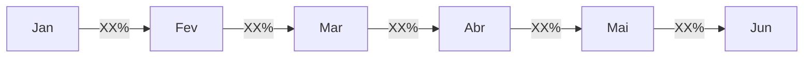

# Principais Insights - Análise de Cohort

## 📊 Visão Geral

Este documento será atualizado conforme a análise progride, documentando os principais insights, descobertas e recomendações baseadas nos dados de cohort.

---

## 🎯 Objetivos da Análise

- [ ] Identificar taxa de retenção média por período
- [ ] Comparar performance entre diferentes cohorts
- [ ] Detectar padrões sazonais ou temporais
- [ ] Identificar pontos críticos de churn
- [ ] Segmentar usuários por comportamento
- [ ] Calcular LTV (Lifetime Value) estimado
- [ ] Gerar recomendações acionáveis

---

## 📈 Insights Principais

> **Nota**: Esta seção será preenchida após a análise dos dados reais.

### 1. Retenção Geral

#### Taxa de Retenção Mês 1
- **Métrica**: XX%
- **Interpretação**: [A ser preenchido]
- **Benchmark**: Indústria típica: 20-40%
- **Status**: 🟢 Acima / 🟡 Na média / 🔴 Abaixo

#### Taxa de Retenção Mês 3
- **Métrica**: XX%
- **Interpretação**: [A ser preenchido]
- **Benchmark**: Indústria típica: 15-25%

#### Taxa de Retenção Mês 6
- **Métrica**: XX%
- **Interpretação**: [A ser preenchido]
- **Benchmark**: Indústria típica: 10-20%

---

### 2. Análise de Churn

#### Ponto de Maior Queda
- **Período**: Mês X
- **Magnitude**: XX% de churn
- **Possíveis Causas**:
  - [ ] Fim de período de trial
  - [ ] Falta de engajamento inicial
  - [ ] Problemas de onboarding
  - [ ] Concorrência
  - [ ] Outros: [especificar]

#### Curva de Churn
```
Período 0→1: XX% de churn
Período 1→2: XX% de churn
Período 2→3: XX% de churn
```

**Observações**:
- [A ser preenchido após análise]

---

### 3. Comparação entre Cohorts

#### Melhor Cohort
- **Cohort**: [Mês/Ano]
- **Retenção Média**: XX%
- **Características**:
  - [Característica 1]
  - [Característica 2]
  - [Característica 3]

#### Pior Cohort
- **Cohort**: [Mês/Ano]
- **Retenção Média**: XX%
- **Possíveis Razões**:
  - [Razão 1]
  - [Razão 2]
  - [Razão 3]

#### Tendência Temporal
- **Direção**: 📈 Melhorando / 📊 Estável / 📉 Piorando
- **Taxa de Mudança**: XX% por mês
- **Análise**: [A ser preenchido]

---

### 4. Segmentação

#### Por Canal de Aquisição

| Canal | Retenção Mês 1 | Retenção Mês 3 | Retenção Mês 6 |
|-------|----------------|----------------|----------------|
| Organic | XX% | XX% | XX% |
| Paid | XX% | XX% | XX% |
| Referral | XX% | XX% | XX% |
| Direct | XX% | XX% | XX% |

**Insights**:
- Canal com melhor retenção: [Canal]
- Canal com pior retenção: [Canal]
- Recomendação: [A ser preenchido]

#### Por Segmento de Usuário

| Segmento | Retenção Mês 1 | Retenção Mês 3 | Retenção Mês 6 |
|----------|----------------|----------------|----------------|
| Free | XX% | XX% | XX% |
| Trial | XX% | XX% | XX% |
| Premium | XX% | XX% | XX% |

**Insights**:
- [A ser preenchido]

---

### 5. Padrões Sazonais

#### Variação por Mês de Aquisição



**Observações**:
- Meses com melhor aquisição: [Meses]
- Meses com pior aquisição: [Meses]
- Padrões identificados: [A ser preenchido]

---

### 6. Lifetime Value (LTV)

#### LTV Estimado por Cohort

| Cohort | Ticket Médio | Retenção Acumulada | LTV Estimado |
|--------|--------------|-------------------|--------------|
| Jan/2024 | R$ XX | XX meses | R$ XXX |
| Fev/2024 | R$ XX | XX meses | R$ XXX |
| Mar/2024 | R$ XX | XX meses | R$ XXX |

**Fórmula**:
```
LTV = Ticket Médio × Soma(Taxas de Retenção)
```

**Insights**:
- LTV médio: R$ XXX
- Tendência: [A ser preenchido]
- Comparação com CAC: [A ser preenchido]

---

## 🎯 Descobertas Críticas

### Descoberta #1: [Título]
**Descrição**: [Detalhamento da descoberta]

**Evidências**:
- [Evidência 1]
- [Evidência 2]
- [Evidência 3]

**Impacto**: 🔴 Alto / 🟡 Médio / 🟢 Baixo

**Recomendação**: [Ação sugerida]

---

### Descoberta #2: [Título]
**Descrição**: [Detalhamento da descoberta]

**Evidências**:
- [Evidência 1]
- [Evidência 2]

**Impacto**: 🔴 Alto / 🟡 Médio / 🟢 Baixo

**Recomendação**: [Ação sugerida]

---

## 💡 Recomendações Acionáveis

### Curto Prazo (0-3 meses)

1. **[Recomendação 1]**
   - **Objetivo**: [Objetivo específico]
   - **Ação**: [Passos concretos]
   - **Métrica de Sucesso**: [Como medir]
   - **Responsável**: [Área/Pessoa]
   - **Prazo**: [Data]

2. **[Recomendação 2]**
   - **Objetivo**: [Objetivo específico]
   - **Ação**: [Passos concretos]
   - **Métrica de Sucesso**: [Como medir]
   - **Responsável**: [Área/Pessoa]
   - **Prazo**: [Data]

---

### Médio Prazo (3-6 meses)

1. **[Recomendação 1]**
   - **Objetivo**: [Objetivo específico]
   - **Ação**: [Passos concretos]
   - **Métrica de Sucesso**: [Como medir]

2. **[Recomendação 2]**
   - **Objetivo**: [Objetivo específico]
   - **Ação**: [Passos concretos]
   - **Métrica de Sucesso**: [Como medir]

---

### Longo Prazo (6-12 meses)

1. **[Recomendação 1]**
   - **Objetivo**: [Objetivo específico]
   - **Ação**: [Passos concretos]
   - **Métrica de Sucesso**: [Como medir]

---

## 📊 Visualizações Principais

### Gráfico 1: Curva de Retenção por Cohort


**Interpretação**: [A ser preenchido]

---

### Gráfico 2: Heatmap de Retenção


**Interpretação**: [A ser preenchido]

---

### Gráfico 3: Comparação entre Canais


**Interpretação**: [A ser preenchido]

---

## 🔄 Próximos Passos

### Análises Adicionais Recomendadas

- [ ] Análise de funil de conversão
- [ ] Segmentação por comportamento de uso
- [ ] Análise de features mais utilizadas
- [ ] Correlação entre engajamento e retenção
- [ ] Análise de RFM (Recency, Frequency, Monetary)
- [ ] Previsão de churn com machine learning

### Melhorias no Processo

- [ ] Automatizar coleta de dados
- [ ] Implementar dashboard em tempo real
- [ ] Criar alertas para anomalias
- [ ] Integrar com outras fontes de dados
- [ ] Desenvolver modelo preditivo

---

## 📝 Notas e Observações

### Limitações da Análise Atual

- [Limitação 1]
- [Limitação 2]
- [Limitação 3]

### Premissas Assumidas

- [Premissa 1]
- [Premissa 2]
- [Premissa 3]

### Contexto de Negócio

- [Contexto relevante 1]
- [Contexto relevante 2]
- [Contexto relevante 3]

---

## 📅 Histórico de Atualizações

| Data | Versão | Alterações | Autor |
|------|--------|------------|-------|
| [Data] | 0.1 | Criação do documento template | [Nome] |
| [Data] | 1.0 | Primeira análise completa | [Nome] |
| [Data] | 1.1 | Atualização com novos dados | [Nome] |

---

## 🔗 Referências

- [Link para dashboard]
- [Link para dados brutos]
- [Link para análises relacionadas]
- [Link para documentação adicional]

---

**Última atualização**: [Data]  
**Versão**: 0.1 (Template)  
**Status**: 🟡 Em Desenvolvimento

---

> **💡 Dica**: Este documento deve ser atualizado regularmente (mensal ou trimestral) conforme novos dados são coletados e analisados. Use-o como base para apresentações e tomada de decisão estratégica.
