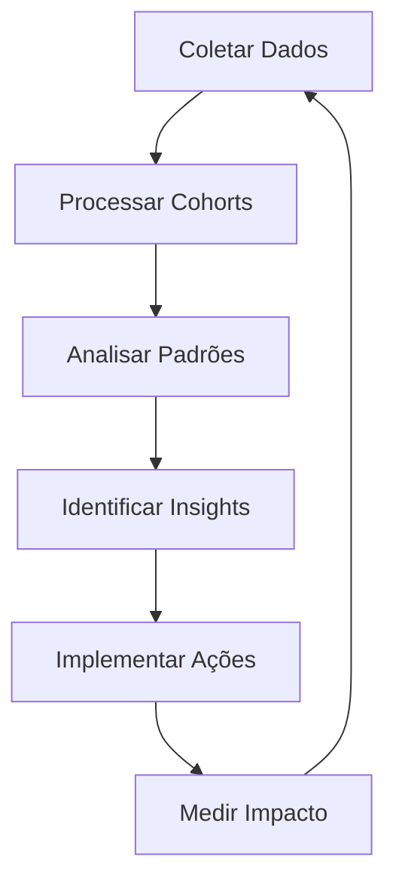

# Metodologia - Análise de Cohort

## 📚 Fundamentos Teóricos

### O que é Cohort Analysis?

Cohort Analysis é uma técnica de análise que divide usuários em grupos mutuamente exclusivos (cohorts) baseados em características compartilhadas durante um período específico. Esses grupos são então acompanhados ao longo do tempo para identificar padrões de comportamento.

### Por que usar Cohort Analysis?

1. **Identificar Tendências Temporais**: Entender como o comportamento muda ao longo do tempo
2. **Medir Retenção**: Avaliar quantos usuários continuam engajados
3. **Validar Mudanças**: Comparar cohorts antes e depois de alterações no produto
4. **Segmentação Inteligente**: Identificar grupos com comportamentos distintos

---

## 🔬 Metodologia Aplicada

### 1. Definição de Cohorts

#### Critério de Agrupamento
- **Base**: Data da primeira interação/compra/cadastro
- **Granularidade**: Mensal (pode ser ajustado para semanal ou trimestral)
- **Período de Análise**: 12 meses de acompanhamento

#### Exemplo de Estrutura

```
Cohort Jan/2024: Todos os usuários que iniciaram em Janeiro de 2024
Cohort Fev/2024: Todos os usuários que iniciaram em Fevereiro de 2024
...
```

### 2. Coleta de Dados

#### Dados Necessários

| Campo | Tipo | Descrição | Exemplo |
|-------|------|-----------|---------|
| `user_id` | Texto/Número | Identificador único do usuário | "USER001" |
| `first_interaction_date` | Data | Data da primeira interação | 15/01/2024 |
| `interaction_date` | Data | Data de cada interação subsequente | 20/02/2024 |
| `event_type` | Texto | Tipo de evento (opcional) | "compra", "login" |
| `value` | Número | Valor monetário (opcional) | 150.00 |

#### Estrutura de Dados Brutos

```
user_id | first_interaction_date | interaction_date | event_type | value
--------|------------------------|------------------|------------|-------
U001    | 2024-01-15            | 2024-01-15       | signup     | 0
U001    | 2024-01-15            | 2024-02-10       | purchase   | 100
U002    | 2024-01-20            | 2024-01-20       | signup     | 0
U002    | 2024-01-20            | 2024-03-05       | purchase   | 75
```

### 3. Processamento de Dados

#### Passo 1: Atribuição de Cohort

```excel
=TEXTO(first_interaction_date;"MMM/YYYY")
```

Atribui cada usuário ao cohort baseado no mês/ano da primeira interação.

#### Passo 2: Cálculo de Período Relativo

```excel
=DATEDIF(first_interaction_date; interaction_date; "M")
```

Calcula quantos meses se passaram desde a primeira interação.

#### Passo 3: Agregação por Cohort e Período

Utiliza-se Tabela Dinâmica ou fórmulas `CONT.SE.S` para contar usuários únicos:

```excel
=CONT.SE.S(
    cohort_range; cohort_name;
    period_range; period_number;
    user_id_range; "<>"
)
```

### 4. Cálculo de Métricas

#### Taxa de Retenção

```excel
Retenção(%) = (Usuários Ativos no Período N / Total de Usuários no Cohort) × 100
```

**Fórmula Excel:**
```excel
=(CONT.SE.S(cohort_range; cohort_name; period_range; period_n) / 
  CONT.SE(cohort_range; cohort_name)) * 100
```

#### Taxa de Churn

```excel
Churn(%) = 100 - Retenção(%)
```

#### Retenção Acumulada

```excel
Retenção Acumulada = Média das taxas de retenção até o período N
```

### 5. Visualização

#### Tabela de Cohort (Heatmap)

```
         | Mês 0 | Mês 1 | Mês 2 | Mês 3 | ...
---------|-------|-------|-------|-------|-----
Jan/2024 | 100%  | 45%   | 32%   | 28%   | ...
Fev/2024 | 100%  | 48%   | 35%   | 30%   | ...
Mar/2024 | 100%  | 50%   | 38%   | -     | ...
```

**Formatação Condicional:**
- Verde escuro: Retenção > 50%
- Verde claro: Retenção 30-50%
- Amarelo: Retenção 15-30%
- Vermelho: Retenção < 15%

#### Gráficos Recomendados

1. **Linha de Retenção**: Múltiplas linhas, uma por cohort
2. **Heatmap**: Visualização de matriz com cores
3. **Barras Empilhadas**: Comparação entre cohorts
4. **Curva de Retenção Média**: Média de todos os cohorts

---

## 📊 Análise e Interpretação

### Padrões a Observar

#### 1. Curva de Retenção Natural

- **Queda Inicial Acentuada**: Normal nos primeiros 1-3 meses
- **Estabilização**: Usuários leais permanecem após período inicial
- **Formato Ideal**: Curva que se estabiliza acima de 20-30%

#### 2. Comparação entre Cohorts

- **Melhoria Progressiva**: Cohorts mais recentes com melhor retenção
- **Deterioração**: Pode indicar problemas no produto/serviço
- **Sazonalidade**: Variações esperadas em determinados períodos

#### 3. Pontos de Inflexão

- **Onde ocorre maior queda**: Identifica momento crítico
- **Oportunidades de Intervenção**: Ações para melhorar retenção

### Perguntas-Chave a Responder

1. ✅ Qual a taxa de retenção no primeiro mês?
2. ✅ Em que período ocorre a maior queda?
3. ✅ Há diferença significativa entre cohorts?
4. ✅ Existem padrões sazonais?
5. ✅ Qual o perfil dos usuários mais leais?

---

## 🎯 Aplicações Práticas

### 1. Produto/Serviço

- Identificar features que aumentam retenção
- Otimizar onboarding de novos usuários
- Priorizar melhorias baseadas em impacto

### 2. Marketing

- Avaliar efetividade de campanhas
- Comparar canais de aquisição
- Calcular LTV (Lifetime Value) por cohort

### 3. Estratégia de Negócio

- Projeções financeiras mais precisas
- Identificação de segmentos de alto valor
- Tomada de decisão baseada em dados

---

## 🔄 Ciclo de Melhoria Contínua



### Processo Iterativo

1. **Análise Inicial**: Estabelecer baseline
2. **Hipóteses**: Formular explicações para padrões
3. **Ações**: Implementar melhorias
4. **Medição**: Comparar novos cohorts com baseline
5. **Refinamento**: Ajustar estratégia baseado em resultados

---

## 📖 Referências e Leitura Adicional

### Conceitos Fundamentais

- **Cohort Analysis**: Técnica de segmentação temporal
- **Retention Rate**: Métrica de engajamento contínuo
- **Churn Rate**: Taxa de abandono de usuários
- **Customer Lifetime Value (LTV)**: Valor total gerado por cliente

### Recursos Recomendados

- 📚 "Lean Analytics" - Alistair Croll & Benjamin Yoskovitz
- 📚 "Measure What Matters" - John Doerr
- 🌐 Artigos sobre Cohort Analysis em blogs de Product Management
- 🎓 Cursos de Data Analytics focados em métricas de produto

---

## ⚠️ Limitações e Considerações

### Limitações da Análise

1. **Tamanho da Amostra**: Cohorts pequenos podem ter alta variabilidade
2. **Fatores Externos**: Mudanças de mercado podem afetar comparações
3. **Definição de "Ativo"**: Critério deve ser consistente
4. **Período de Análise**: Mínimo de 6-12 meses para insights robustos

### Boas Práticas

✅ Manter definições consistentes ao longo do tempo  
✅ Documentar mudanças em metodologia  
✅ Combinar com outras análises (segmentação, funnel)  
✅ Validar dados regularmente  
✅ Considerar contexto de negócio na interpretação  

---

**Última atualização**: Janeiro 2026  
**Versão**: 1.0
